# Create Research Reports with Biomedical AI-Q Research Agent Developer Blueprint User Interface

The Biomedical AI-Q Research Agent, which is adapted from the AI-Q NVIDIA Research Assistant Blueprint, builds off of the NVIDIA RAG Blueprint, allowing users to upload multi-modal PDFs and then create detailed research reports. 

- The beginning of the UI experience will look like this. Click on `Begin Researching` to start.
  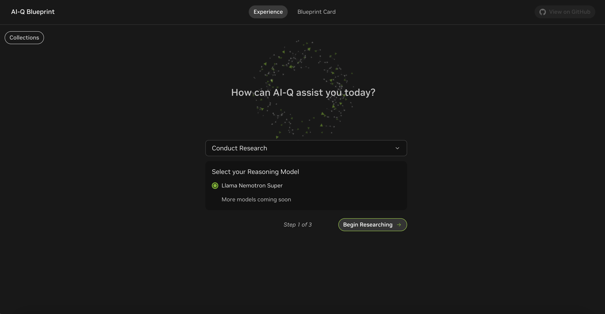

- First a user needs to select a dataset. Example datasets are included when you ran the steps in `Add Default Collections` / `Upload Default Collections` of the getting started guide.
- Ensure you see the Healthcare dataset in the Example Collections on the left side of the UI. We will select the Biomedical Dataset with PDFs containing research on Cystic Fibrosis. 
- If and when users would like to experiment with their test documents, create and upload files to a new collection via the `Add Files` / `New Collection` buttons on the left side of the UI. For ingesting documents on a larger scale in deployment, please refer to the [NVIDIA RAG Blueprint](https://github.com/NVIDIA-AI-Blueprints/rag)'s documentation.
- For the `Report Topic` field, this is the place to input the name of the condition or disease that is being researched, in this example, it's cystic fibrosis. 
- Please read the content of the `Report Structure` field, this is the place where users will inform the research agent the intended content in their report. 

  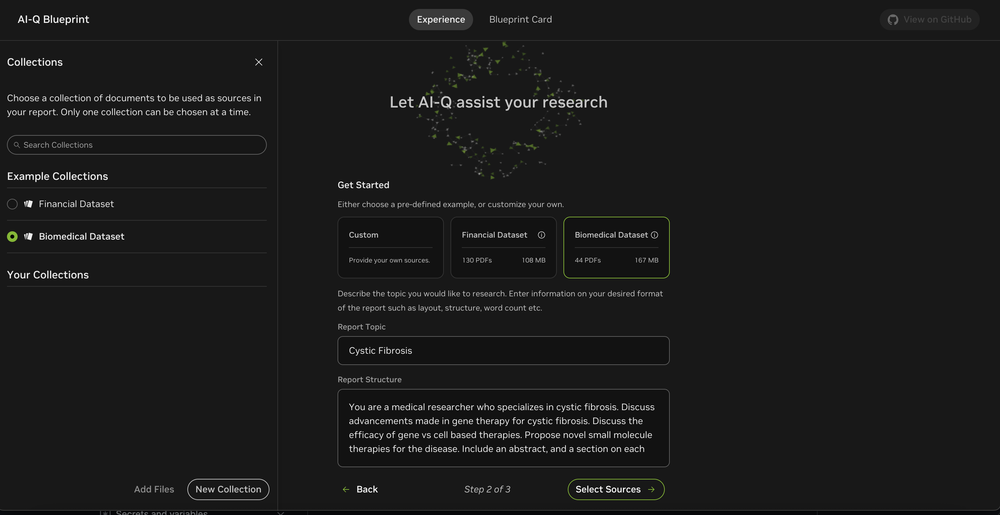

  ```
  # Example Report Structure
  You are a medical researcher who specializes in cystic fibrosis. Discuss advancements made in gene therapy for cystic fibrosis. Discuss the efficacy of gene vs cell based therapies. Propose novel small molecule therapies for the disease. Include an abstract, and a section on each topic. Format your answer in paragraphs. Consider all (and only) relevant data. Give a factual report with cited sources.
  ```

- Confirm the dataset Collection you chose at the previous step, and decide whether you'd like to include Web Search powered by Tavily in the research process. Then click on `Start Generating` to start the query generation part of the agent, calling the reasoning model to generate queries for the content indicated by the `Report Structure` from the previous steps.

  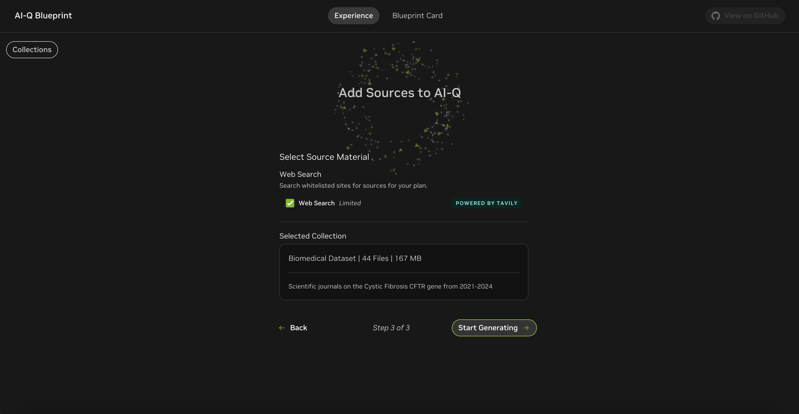

- Review and edit a research plan.
  ``` 
  # Example Research Plan

  Query: Recent clinical trials on gene therapy for cystic fibrosis (2020-2023)
  Section: Advancements made in gene therapy for cystic fibrosis
  Rationale: Identify cutting-edge gene therapy trials, outcomes, and emerging technologies (e.g., CRISPR) relevant to CF treatment.

  Query: Comparative efficacy of gene therapy vs. cell therapy in cystic fibrosis preclinical/clinical studies
  Section: Efficacy of gene vs cell based therapies
  Rationale: Gather data on therapeutic outcomes, durability, and safety profiles to support a comparative analysis.

  Query: Novel small molecule therapies targeting CFTR function in early-stage development for cystic fibrosis
  Section: Propose novel small molecule therapies for the disease
  Rationale: Targets emerging compounds addressing CFTR dysfunction, including potency, specificity, and potential combinations with existing therapies.
  ```
   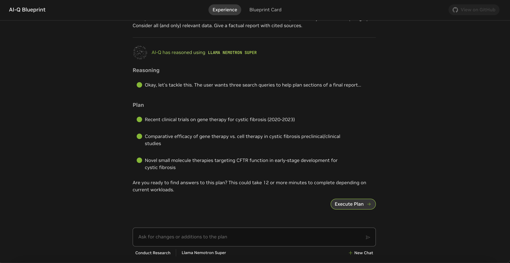

- Click "Execute Plan", and this should start the report generation and optionally the Virtual Screening process. The reasoning model determines from the user’s input `Report Topic` and `Report Structure`, whether virtual screening would be helpful for research. In this case, the reasoning model determines yes.

   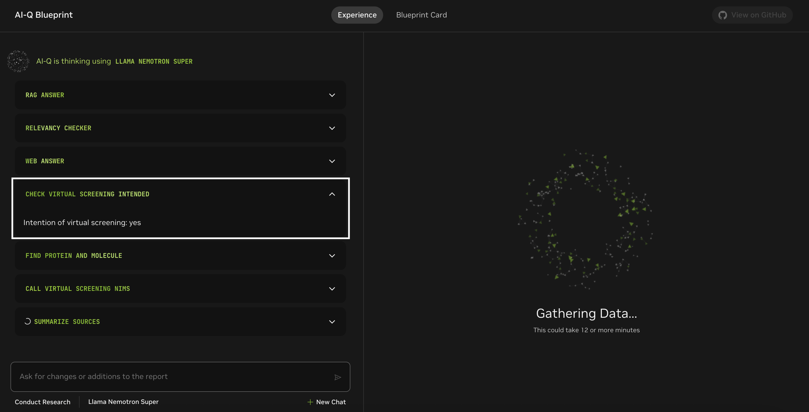

- Once it’s decided that virtual screening is intended, the reasoning model then creates and sends queries to find the target protein and a recent small-molecule therapy as inputs to start virtual screening. This happens within the expandable section `Find Protein and Molecule`.
   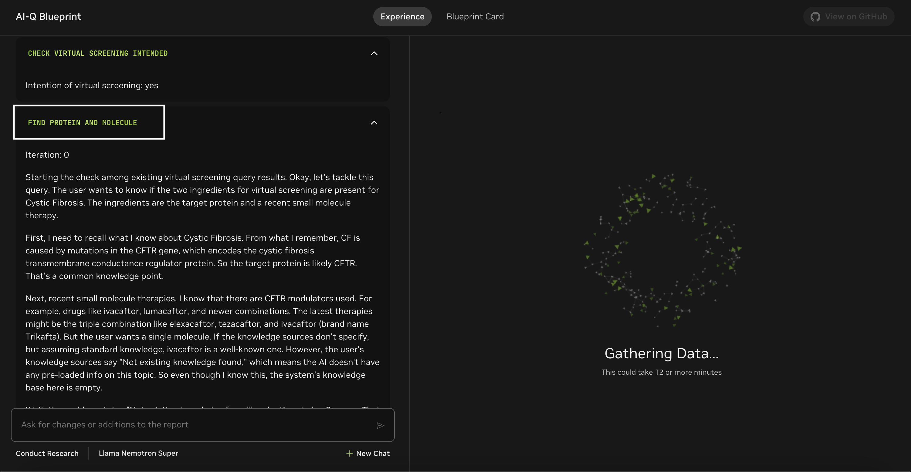

- The end of the section `Find Protein and Molecule` should summarize the name of the target protein and the name of the recent small-molecule therapy that had been found from the queries.
   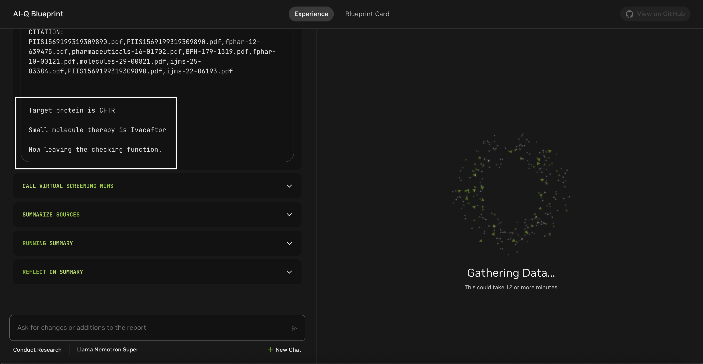

- The next expandable section `Call Virtual Screening NIMs` should inform us in great details of the virtual screening process, including inputs/outputs to the MolMIM NIM and DiffDock NIM. These details should also be included exactly as they are in the final report in a separate section for Virtual Screening.
    - The result of searching for the protein ID based on the target protein name found from the `Find Protein and Molecule` section. 
      > Note: it's highly likely that with the search criteria including the protein name, source organism = homo sapiens, and experimental method = electron microscopy, there will be more than one protein IDs returned from the RCSB API search. For demonstration purposes in this developer blueprint, we have implemented picking the first protein ID out of the list of returned IDs, and when you deploy the blueprint in your system, we will leave it up to you to design the interactive human-in-the-loop UI that will get your organization's domain experts' selection / confirmation of the protein ID to be used in Virtual Screening.
    - The location relative to this repo's root directory where the target protein's PDB file has been downloaded.
    - The result of searching for the Molecule SMILES string for the recent small-molecule therapy as the seed molecule
    - The generated ligands from MolMIM based on the seed molecule
    - The success of docking the generated ligands into the target protein in DiffDock, docking scores, and the location where the docking scores and docking positions (mol files) have been written to.

   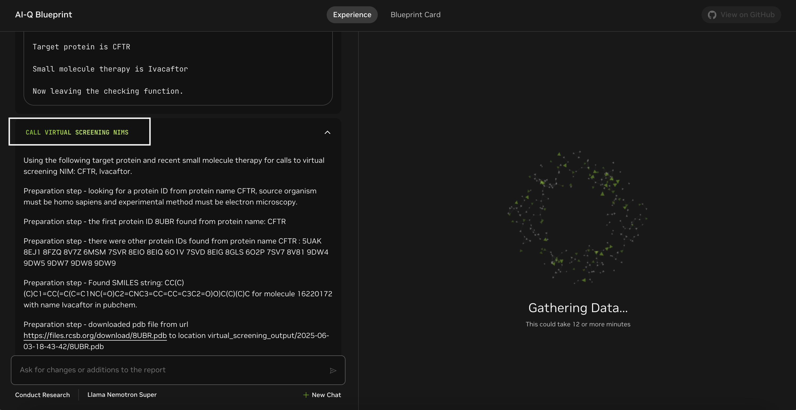
   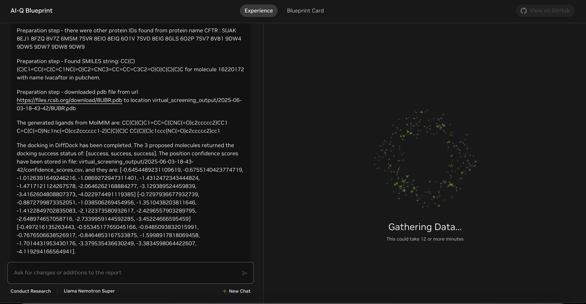
 
- As part of the original AI-Q NVIDIA Research Assistant Blueprint's research capability, the agent is also performing deep research to create a report, sourcing data from the on-premise documents and the web. When the research and virtual screening concludes, there should be a report generated on the right side of the UI.

  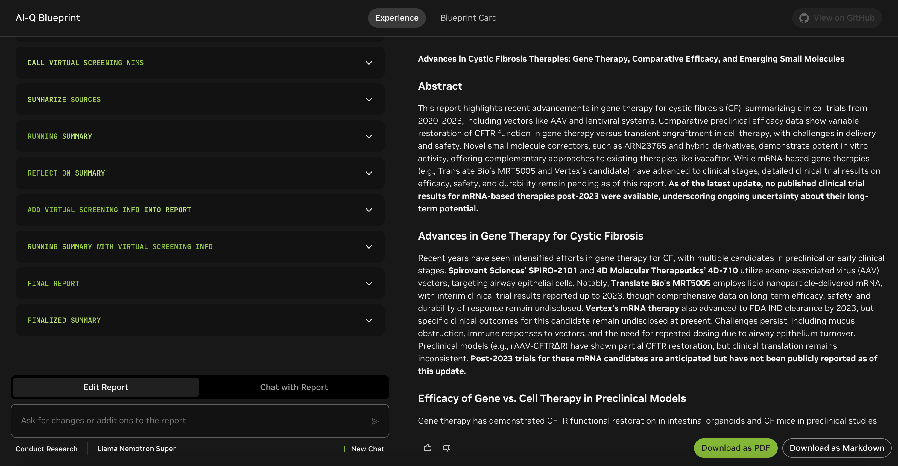

- The report should cover topics that were mentioned in the `Report Structure` field, as well as a seperate section `Running Virtual Screening for Novel Small Molecule Therapies` for documenting the details of virtual screening, including the output path and directory relative to the repo root where the target protein pdb file, docking scores, and docking positions have been saved.

  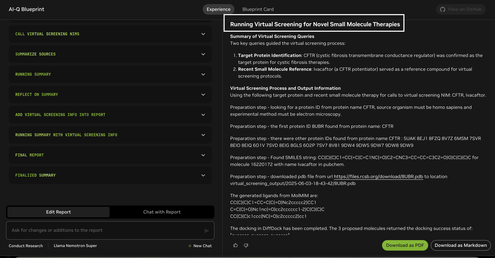
  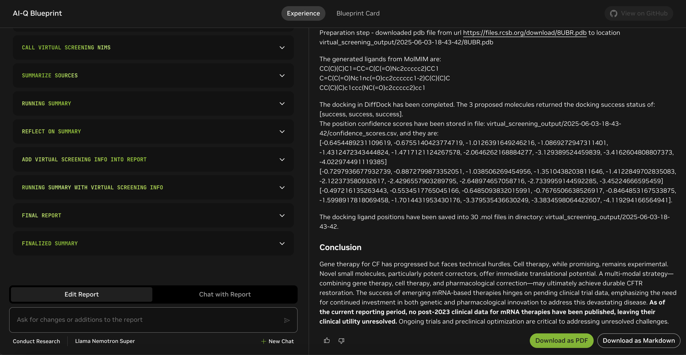
  
  An example for what the report should roughly look like with the default content in `Report Topic` and `Report Structure` launching the research process is saved in [example_report.md](./example_report.md).
  ``` 
  # Example Report 

  **Advances in Cystic Fibrosis Therapies: Gene Therapy, Comparative Efficacy, and Emerging Small Molecules**

  ### **Abstract**
  This report highlights recent advancements in gene therapy for cystic fibrosis (CF), summarizing clinical trials from 2020–2023, including vectors like AAV and lentiviral systems. Comparative preclinical efficacy data show variable restoration of CFTR function in gene therapy versus transient engraftment in cell therapy, with challenges in delivery and safety. Novel small molecule correctors, such as ARN23765 and hybrid derivatives, demonstrate potent in vitro activity, offering complementary approaches to existing therapies like ivacaftor. While mRNA-based gene therapies (e.g., Translate Bio’s MRT5005 and Vertex’s candidate) have advanced to clinical stages, detailed clinical trial results on efficacy, safety, and durability remain pending as of this report. **As of the latest update, no published clinical trial results for mRNA-based therapies post-2023 were available, underscoring ongoing uncertainty about their long-term potential.**

  ### **Advances in Gene Therapy for Cystic Fibrosis**
  Recent years have seen intensified efforts in gene therapy for CF, with multiple candidates in preclinical or early clinical stages. **Spirovant Sciences’ SPIRO-2101** and **4D Molecular Therapeutics’ 4D-710** utilize adeno-associated virus (AAV) vectors, targeting airway epithelial cells. Notably, **Translate Bio’s MRT5005** employs lipid nanoparticle-delivered mRNA, with interim clinical trial results reported up to 2023, though comprehensive data on long-term efficacy, safety, and durability of response remain undisclosed. **Vertex’s mRNA therapy** also advanced to FDA IND clearance by 2023, but specific clinical outcomes for this candidate remain undisclosed at present. Challenges persist, including mucus obstruction, immune responses to vectors, and the need for repeated dosing due to airway epithelium turnover. Preclinical models (e.g., rAAV-CFTRΔR) have shown partial CFTR restoration, but clinical translation remains inconsistent. **Post-2023 trials for these mRNA candidates are anticipated but have not been publicly reported as of this update.**

  ### **Efficacy of Gene vs. Cell Therapy in Preclinical Models**
  Gene therapy has demonstrated CFTR functional restoration in intestinal organoids and CF mice in preclinical studies (e.g., Vidović et al., 2016), but clinical efficacy is limited by biological barriers, requiring repeated administration due to transient expression in renewing epithelia. In contrast, cell therapy, such as allogeneic airway stem cell transplantation, shows proof-of-principle in mice (Miller et al., 2018), with engraftment lasting weeks. However, human applicability faces hurdles like conditioning protocols and tumorigenic risks from manipulated cells (Berical et al., 2019). Cell therapy may offer durable correction if engraftment challenges are overcome, whereas gene therapy requires overcoming delivery inefficiencies.

  ### **Proposed Novel Small Molecule Therapies**
  Early-stage small molecules address CFTR dysfunction directly. **ARN23765**, a type I corrector, exhibits picomolar potency (EC₅₀: 38 pM). Hybrid compounds (e.g., **2a, 7a, 7m**) combining amino-arylthiazole and benzodioxole motifs show additive effects with standard correctors (VX661/VX445). These could enhance existing combination therapies (e.g., Kaftrio) by improving CFTR folding and stability. Their development highlights the potential for oral, sustainable treatments to complement genetic approaches.

  ### **Running Virtual Screening for Novel Small Molecule Therapies**
  **Summary of Virtual Screening Queries**  
  Two key queries guided the virtual screening process:  
  1. **Target Protein Identification**: CFTR (cystic fibrosis transmembrane conductance regulator) was confirmed as the target protein for cystic fibrosis therapies.  
  2. **Recent Small Molecule Reference**: Ivacaftor (a CFTR potentiator) served as a reference compound for virtual screening protocols.  

  **Virtual Screening Process and Output Information**  
  Using the following target protein and recent small molecule therapy for calls to virtual screening NIM: CFTR, Ivacaftor.  
  
  Preparation step - looking for a protein ID from protein name CFTR, source organism must be homo sapiens and experimental method must be electron microscopy.  
  
  Preparation step - the first protein ID 8UBR found from protein name: CFTR  
  
  Preparation step - there were other protein IDs found from protein name CFTR : 5UAK 8EJ1 8FZQ 8V7Z 6MSM 7SVR 8EIO 8EIQ 6O1V 7SVD 8EIG 8GLS 6O2P 7SV7 8V81 9DW4 9DW5 9DW7 9DW8 9DW9  
  
  Preparation step - Found SMILES string: CC(C)(C)C1=CC(=C(C=C1NC(=O)C2=CNC3=CC=CC=C3C2=O)O)C(C)(C)C for molecule 16220172 with name Ivacaftor in pubchem.  
  
  Preparation step - downloaded pdb file from url https://files.rcsb.org/download/8UBR.pdb to location virtual_screening_output/2025-06-03-18-43-42/8UBR.pdb  
  
  The generated ligands from MolMIM are:  
  CC(C)(C)C1=CC=C(C(=O)Nc2ccccc2)CC1  
  C=C(C(=O)Nc1nc(=O)cc2cccccc1-2)C(C)(C)C  
  CC(C)(C)c1ccc(NC(=O)c2ccccc2)cc1  
  
  The docking in DiffDock has been completed. The 3 proposed molecules returned the docking success status of: [success, success, success].  
  The position confidence scores have been stored in file: virtual_screening_output/2025-06-03-18-43-42/confidence_scores.csv, and they are:  
  [-0.6454489231109619, -0.6755140423774719, -1.0126391649246216, -1.0869272947311401, -1.4312472343444824, -1.4717121124267578, -2.0646262168884277, -3.129389524459839, -3.4162604808807373, -4.022974491119385]  
  [-0.7297936677932739, -0.8872799873352051, -1.038506269454956, -1.3510438203811646, -1.4122849702835083, -2.122373580932617, -2.4296557903289795, -2.648974657058716, -2.7339959144592285, -3.45224666595459]  
  [-0.497216135263443, -0.5534517765045166, -0.6485093832015991, -0.7676506638526917, -0.8464853167533875, -1.5998917818069458, -1.7014431953430176, -3.379535436630249, -3.3834598064422607, -4.119294166564941].  
  
  The docking ligand positions have been saved into 30 .mol files in directory: virtual_screening_output/2025-06-03-18-43-42.  

  ### **Conclusion**
  Gene therapy for CF has progressed but faces technical hurdles. Cell therapy, while promising, remains experimental. Novel small molecules, particularly potent correctors, offer immediate translational potential. A multi-modal strategy—combining gene therapy, cell therapy, and pharmacological correction—may ultimately achieve durable CFTR restoration. The success of emerging mRNA-based therapies hinges on pending clinical trial data, emphasizing the need for continued investment in both genetic and pharmacological innovation to address this devastating disease. **As of the current reporting period, no post-2023 clinical data for mRNA therapies have been published, leaving their clinical utility unresolved.** Ongoing trials and preclinical optimization are critical to addressing unresolved challenges. 

  ## Sources 


  ---
  **Source** 1

  **Query:** Novel small molecule correctors for CFTR protein in early-stage development

  **Answer:**
  ARN23765, a novel type I corrector, has shown picomolar potency (EC50: 38 pM) in early development. Additionally, hybrid derivatives 2a, 7a, and 7m, combining amino-arylthiazole and benzodioxole carboxamide moieties, have demonstrated potential as CFTR correctors in in vitro studies, showing additive effects with VX661 and VX445.

  CITATION:
  fphar-10-01662.pdf,cells-11-01868.pdf,pharmaceuticals-16-01702.pdf,cells-11-01868.pdf,cells-11-01868.pdf,BPH-179-1319.pdf,fphar-10-00121.pdf,cells-11-01868.pdf,ijms-22-05262.pdf,41467_2023_Article_42586.pdf


  ---
  **Source** 2
  ...
  ```

- Edit the report or ask follow up questions on the content of the report
 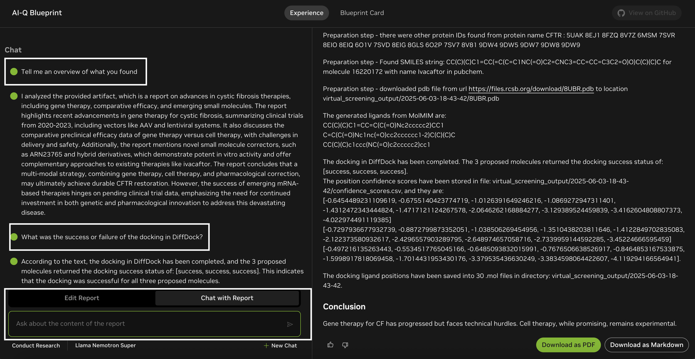

- Download the report as a Markdown or PDF. In the section `Running Virtual Screening for Novel Small Molecule Therapies`, the location of the output files from Virtual Screening should be documented. In the example above, it's `virtual_screening_output/2025-06-03-18-43-42`. In this output directory, we expect 
  - 30 .mol files for the docking positions
  - 1 pdb file for the target protein
  - 1 csv file for the docking position confidence scores.

- Navigate on the root of this GitHub repository on the server where you are running this blueprint, and the output directory path is relative to the root directory. Download the 30 .mol files and the 1 pdb file, and visualize the docking positions in a viewer such as https://molstar.org/viewer/.
 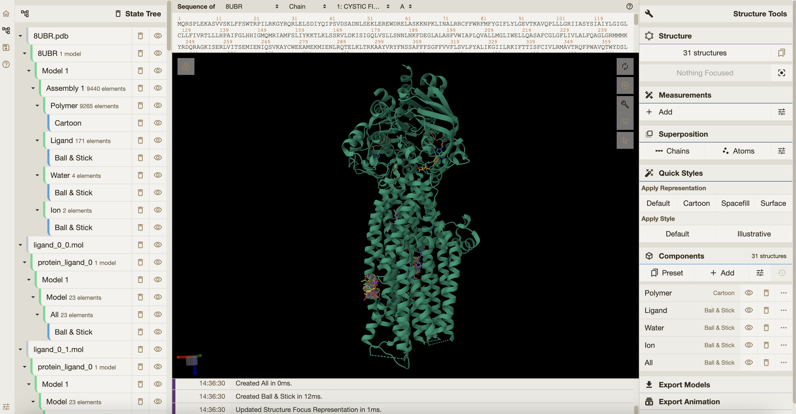