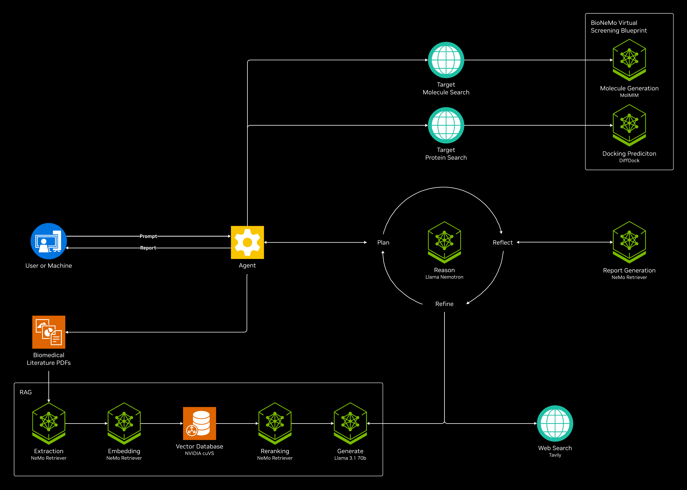

# Customization 

## Add Your Own Functionalities In Addition to Research
The core research functionality of the [AI-Q NVIDIA Research Assistant](https://build.nvidia.com/nvidia/aiq) is implemented in the application located in [aira/](../aira/) powered by [NVIDIA NeMo Agent Toolkit](https://github.com/NVIDIA/NeMo-Agent-Toolkit). 

The two main functions that compose the research application, `generate_query` and `generate_summary` are defined in [aira/src/aiq_aira/functions/](../aira/src/aiq_aira/functions/). They are connected in the [register.py](../aira/src/aiq_aira/register.py) where the main application is registered as an app inside the NVIDIA NeMo Agent Toolkit.

The [nodes.py](../aira/src/aiq_aira/nodes.py) file is where the nodes in Langgraph are defined. Each of these nodes are then used by either `generate_query` or `generate_summary` in [aira/src/aiq_aira/functions/](../aira/src/aiq_aira/functions/). 

If we compare the [AI-Q NVIDIA Research Assistant Blueprint](https://build.nvidia.com/nvidia/aiq) and this [Biomedical AI-Q Research Agent Developer Blueprint]( https://build.nvidia.com/nvidia/biomedical-aiq-research-agent), the core functionality of the additional Virtual Screening that is our adaptation to the original AI-Q NVIDIA Research Assistant Blueprint went into the files mentioned above. We modified the graph in Langgraph as seen in [`generate_summary.py`](../aira/src/aiq_aira/functions/generate_summary.py), where we have added the additional nodes `begin_virtual_screening_if_intended`, `call_virtual_screening_nims` and `combine_virtual_screening_info_into_summary` into the existing graph from the [AI-Q NVIDIA Research Assistant Blueprint](https://build.nvidia.com/nvidia/aiq) to have Virtual Screening capabilitiess.

```python
builder.add_edge(START, "web_research")
builder.add_edge("web_research", "begin_virtual_screening_if_intended")
builder.add_edge("begin_virtual_screening_if_intended", "call_virtual_screening_nims")
builder.add_edge("call_virtual_screening_nims", "summarize_sources")
builder.add_edge("summarize_sources", "reflect_on_summary")
builder.add_edge("reflect_on_summary", "combine_virtual_screening_info_into_summary")
builder.add_edge("combine_virtual_screening_info_into_summary", "finalize_summary")
builder.add_edge("finalize_summary", END)
```



When you adapt this blueprint for adding your own custom functionalities, you might want to add in entire seperate function(s) in addition to the two functions in [`generate_queries.py`](../aira/src/aiq_aira/functions/generate_queries.py) and [`generate_summary.py`](../aira/src/aiq_aira/functions/generate_summary.py), and connect your function to the rest in [register.py](../aira/src/aiq_aira/register.py). You could also do what we have done in this blueprint, which is simply add nodes to the Langgraph graphs in existing functions. You might also want to remove certain nodes within the graph, or remove a certain function altogether.

## Add Your Own UI

For adding you own UI, you would want to interact with the application through Rest API. Please see the documentation on [this application's Rest API](./rest-api.md) in this repository, and an [example notebook](../notebooks/test_rest_apis.ipynb).

## Protein ID Selection from Search

In our blueprint, we search for the target protein's protein ID in the PDB based on three criteria: including the protein name which is retrieved by the reasoning model from the knowledge base, source organism = homo sapiens, and experimental method = electron microscopy. Not every protein ID can be searched with the same criteria, but we have chosen these criteria for the example research topic we chose - cystic fibrosis. To change the search criteria, please modify ther queries within function `get_protein_id_from_name()` in [aira/src/aiq_aira/nodes.py](../aira/src/aiq_aira/nodes.py). It's highly likely that with the search criteria, there will be more than one protein IDs returned from the RCSB API search. The selection of the protein ID needs input from domain experts. For demonstration purposes in this developer blueprint, we have implemented picking the first protein ID out of the list of returned IDs in function `get_protein_id_from_name()` in [aira/src/aiq_aira/nodes.py](../aira/src/aiq_aira/nodes.py), and when you deploy the blueprint in your system, we will leave it up to you to design the interactive human-in-the-loop UI that will get your organization's domain experts' selection / confirmation of the protein ID to be used in Virtual Screening.